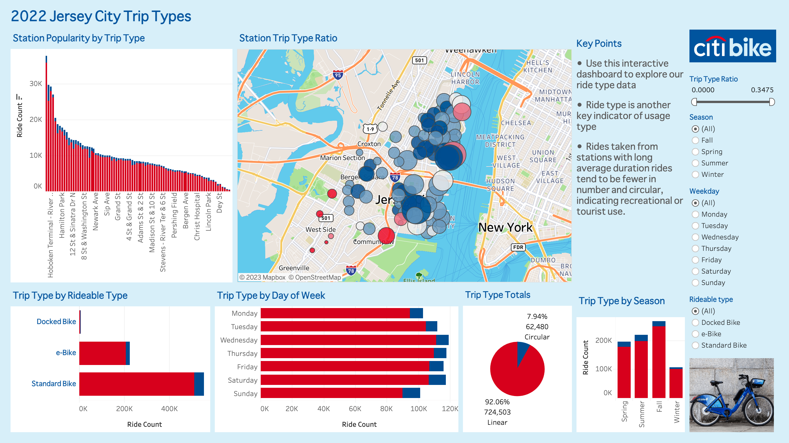

# tableau-citibike-challenge

In this assignment, we are tasked with analysing New York Citi Bike ride data for city officials looking to publicise and improve the city program.

The assignment requires students to implement a dashboard in Tableαu Public to answer city officials' questions about the program.

The Citi Bike program has collected data on the ride utilisation since its inception in 2013. The program began operating west of the Hudson River in Hoboken and Jersey City in September 2015. I chose to work with Jersey City data because the dataset is much smaller. Being derived from only 350 bike stations, it was possible to obtain a whole years worth of ride data and still stay within the data limits of Tableau Public.

I chose to focus on ride duration and ride type (circular v linear) as the two 'phenomena' required for the assignment. These were created as calculated fields from the source data. In addition I created a level of detail expression at the level of 'starting station' that calculated the 'ride type ratio' - the proportion of rides starting at a station that end at the same station. Circular rides, and rides of long duration, were associated with certain stations far away from the CBD and are presumably recreational or tourist rides.

I created two interactive 'Vizs' in a Tableau Story to present my analysis. I created a custom palette in Tabeau and chose a typeface similar to the Citi Bike typeface to give my dashboard a professional look and feel. I decorated my dashboard with images of Jersy City and Citi Bike from the following sources:

- https://img.theculturetrip.com
- https://www.nj.com
- https://citibikenyc.com
- https://www.hobokengirl.com
- https://i.insider.com

You can visit my Citi Bike interactive dashboard at [my Tableau Public profile page](https://public.tableau.com/views/JC2022CitiBikeRideData/JC2022Story?:language=en-US&publish=yes&:display_count=n&:origin=viz_share_link)

